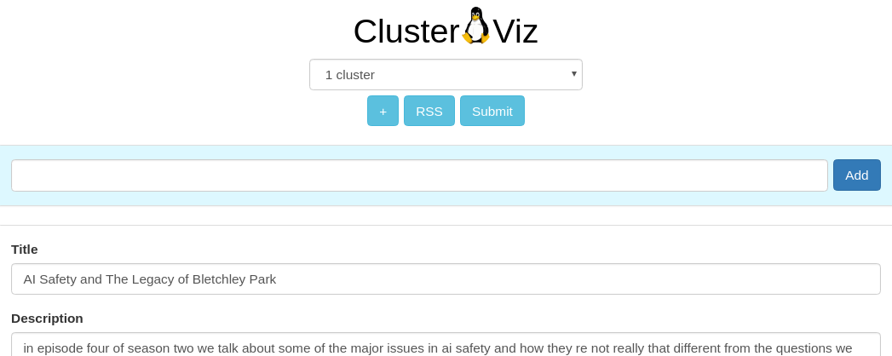

## Cluster Viz

Basic project for learning React/Redux/Webpack.

Import RSS feeds (ie. podcasts, news),
remove entries which you don't like, and it will
draw clusters highlighting interest groups using spherical k-means & tf-idf.

 - - - -

